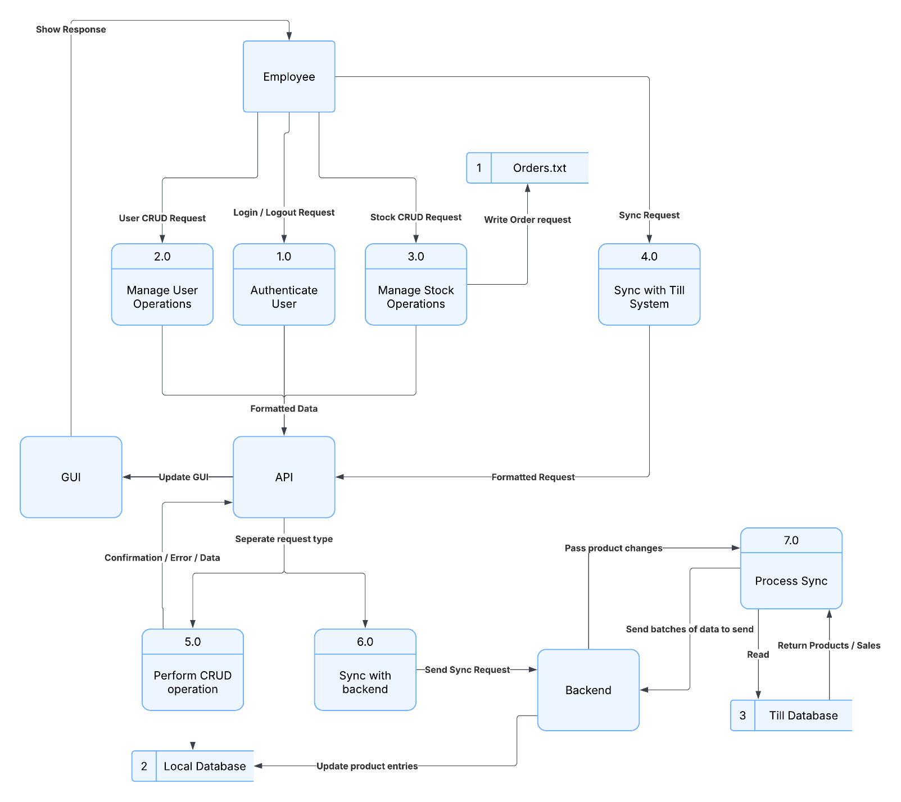

# Stock Management Software Integrated with Aronium Through Flask API
## License

### Code License
All source code in this repository is licensed under the **GNU General Public License v3.0** (GPL-3.0).  
- You may use, modify, and distribute the code
- All derivative works must remain under GPL-3.0
- Commercial use is permitted
- Full license terms: [LICENSE-CODE](https://github.com/Isangerak/NEA-Coursework/edit/main/LICENSE-CODE.md)

## Table Of Contents:
- [Overview](#overview)
- [System Architecture](#system-architecture)
  - [High Level Overview](#high-level-overview)
  - [Stock Management Software](#stock-management-software)
  - [Flask API](#flask-api)
    - [Endpoints](#endpoints)
  - [Till Backend](#till-backend)
- [Code Architecture UML Diagrams](#code-architecture-uml-diagrams)
  - [Frontend (Software)](#frontend-software)
  - [GUI Related Views](#gui-related-views)
  - [Flask API](#flask-api-1)
  - [Backend](#backend)
- [How To Install & Setup](#how-to-install--set-up)
  - [API](#api)
    - [How To Run The Program?](#how-to-run-the-program)
    - [What This Folder Contains](#what-this-folder-contains)
  - [Inventory Software](#inventory-software)
    - [How To Run The Program?](#how-to-run-the-program-1)
    - [What This Folder Contains](#what-this-folder-contains-1)
  - [Till Script](#till-script)
    - [Configuration Requirements](#configuration-requirements)
    - [What This Folder Contains](#how-to-run-the-program-2)
- [Known Issues](#known-issues)
- [Video Tech Demonstration](#video-tech-demonstration)

## Overview
> This project was submitted for A-Level coursework. Original NEA documentation and assessment materials are excluded.

STOCKLE is a is a lightweight stock management system that provides the flexbility of connecting a stock management software, mine or any other (with adequate adjustments) to integrate with a third party till software (Aronium is what this project will use to simulate this). Flask is used as the acting API to bridge these two pieces of software. Despite it's channel being HTTP I have implemented my versions of RSA-2048 and AES-256 to securely transfer data.

Features

    📊 Real-time stock level monitoring

    🔄 Automated synchronization with POS systems

    🔒 Secure RSA/AES encrypted communication

    📈 Sales analytics and reporting dashboard

    ⚙️ Rule-based stock alerts and order generation

    👥 Multi-user permission system

    📦 Supplier-independent order management
This solution implements an MVC Programming Design show as follows:

This allows for the solution to act as a client server mode, giving access to multiple users within a network to access, edit and query data:

The overall data flows is shown as follows:

## System Architecture
### High Level Overview 

The solution will have 3 key components. First is the actual software the end user will interact with, the second is the API script, made using Flask, and the third is the till backend script that is crucial to collect the product information and sales data from the till software. The major benefit is that multiple clients can connect to access data as it operates similarly to a client server model. A quick rundown of the operations and contents of each component are below, followed by a diagram: 

### Stock Management Software
- Handles all user interaction 
- Requires to login through the API’s login endpoint to access information 
- Provides modular functionality depending on user’s privileges 
- Ability to send a sync request to the API for instant data collection from till database 
### Flask API
- Ensures all connections are set up securely by transferring it’s RSA public key for the transfer of symmetric keys, which allow for data transfer 
- Has direct access to the Inventory database that can be updated through the till software  
- Sanitizes all SQL queries before operating

#### Endpoints

    /sync_now - Trigger immediate synchronization

    /status - API health check

    /connect - Secure key exchange

    /process_data - Till data ingestion

    /login - User authentication
- Keeps persistent user credentials through Hashing and storing in JSON file format

### Till Backend

- Has direct access to the Aronium SQL Database, with personalised SQL queries to match the Aronium database schema 
- Uses Hashtable for local comparison and queue to prepare batches for transmission when syncing  
- Has a robust failsafe procedure in case of the API going down mid sync 
- Keeps persistent data in the form of pickle files for: Hashtable, Queue, and Change Log 

## Code Architecture (UML Diagrams)
### Frontend (Software)
The inventory software holds the TkinterApp() with all its associated GUI classes, as well as the
controllers it needs to perform its operations. The GUI Classes are omitted from this diagram to put
more emphasis on the relationships between the controllers.
TkinterApp() and AppController cannot exist without each other and are created at the same time
referencing each other. The AppController has functions to call TkinterApp’s dynamic container “show
frame” function, as well as the ability to control when the API reconnecting overlay shows and is
removed. These two operations are especially important to justify AppController’s existence, as
otherwise both UserController and StockController would have no other way to access the main_view
apart from having to reach through multiple classes to call these functions – breaking the
fundamental of defensive programming. Furthermore, ApiController has no ability to access the
main_view at all, and it doesn’t need access to all of it so therefore AppController allows for
ApiController to trigger overlay events in case it cannot reach the API. UserController and
StockController require the ability to show another frame. For example, in SearchStock() (In GUI UML)
double clicking a product will cause its overview page to show up. This would be impossible without
AppController
All API transcations are managed by the ApiController, such as sending payloads, decrypting,
encrypting, setting up a secure connection, retrieving the public key, and handling an exponential
backoff operation when the API is down.
Both StockController and UserController configure the request type, the endpoint it wants to send it
to, and the data it wants to send (if there is any).

### GUI related Views
The classes are split into 2 types: User oriented views, and Stock oriented views. The different views
have their corresponding controller that they are directly dependent on. User views are all dependent
on UserController and Stock views are all dependent on StockController.
Many classes will have the ability to generate a window to perform a function, such as AddFromList()
creating ChangeQuantity() to enter the new quantity the user wants for that stock. This is the reason
for the dependency and composition relationship.
Entry window is a generalised class that is inherited by classes from either category

### Flask API
API is labelled as an interface in this UML, due to it not strictly being a class but more of a script. Flask
uses function-based views rather than enforcing an Object-Oriented structure, meaning that it would
cause far more code and logic for it to be written as a class, which conflicts with the purpose of
making it lightweight for my end user.
However, despite not being a class it should be considered in the UML diagram as it is the key
orchestrator for the program. The endpoints that are called will trigger an appropriate response to the
request, by calling the correct class for the operation type and performing the CRUD operation. All
these classes call the database manager to run the SQL.
Cryptography classes are used for encrypting and decrypting responses as well as handling new
connections.

### Backend 
The till backend consists of the SyncManager acting as the central orchestrator. It will oversee both
the running threads as well as all the operations the classes should partake in, keeping connections
between all of them minimal to reduce conflicting actions that would be hard to trace otherwise.
The ChangeLog() is the main data structure that will hold majority of the changes that need to be
pushed, while the BatchQueue() is operational when the API is ready to sync. Hashtable will also be a
large data structure, but efficient, as it holds the most up to date till products.
It should be noted that the ApiController(), while similar to Inventory Software’s, is not the same copy.
This has slimmed down capabilities as it has no need to handle sending overlay requests to an
AppController or performing an exponential backoff.

## How to Install & Set up
Default credentials for User:

Username: admin 

password: admin 

The entire implementation is split into 3 different folders

### API
This should be run on the device that is going to be acting as the server hosting all clients running the inventory software. 

>**Note that you can have the API and inventory software running on the same machine, however make sure to reference the API address with it's actual IP Address not the loopback address, ie 192.168.0.5**

**DO NOT RUN FILE FROM WITHIN THE FOLDER HOLDING THE FILE**.

#### How to run the program?
The main program is _api.py_

Example: python3 API/api.py ✓ | python3 api.py ✗
> This is due to the database being referenced from your current working directory. So it should be the directory holding the **folder**

#### What this folder contains?
o Contains the API script, models, local database and user JSON

o Holds the endpoints
### Inventory Software
Unlike the API this should be run from **within the folder** as it will be referencing both _stockle.png_ and _sync_png_ from your current working directory.

**IMPORTANT:** within _inventory_software.py_ you will need to reference the IP Address of the API. A Placeholder will already be there to show you an example of a valid entry.

#### How to run the program?
The main program is _inventory_software.py_

Example: python3 inventory_software.py ✓ | python3 Inventory\ Software/inventory_software.py ✗

#### What this folder contains?
o Contains the main software application, all GUI views, controllers, and cryptography scripts

### Till Script
#### Configuration Requirements

o Placed on the machine with the till software (Aronium)

o Need to specify file path to Aronium database. 
> This can be done through _Backend.py_ at the very bottom of the program. Ensure to use double backslashes due to "\\" being a special character in python strings.

o Needs to reference API IPv4 address
> This can also be done through _Backend.py_ at the very bottom of the program.

**DO NOT RUN FILE FROM WITHIN THE FOLDER HOLDING THE FILE**.

Instead run from directory holding folder, just like the API program

#### How to run the program?
The main program is _Backend.py_

Example: python3 Till\ Script/Backend.py  ✓ | python3 Backend.py ✗

## Known Issues
1) First, is the case of lacking any sort of sales retention policy. This causes a build-up of data within
the sales table that would not delete any records, bloating the database to a level where operations
would occur very slowly. The user should be able to edit this in a text configuration instead of the main
program, keeping the sales database contents limited to holding a certain timeframe (i.e. last 12
months sales).
2) Currently multiple clients can sign in as the same user. This feature would add more complexity to
the authentication process when setting up a session between the software and the API. However,
due to the API taking a large portion of the project time to understand, I was unable to implement the
feature. If this feature was enabled, it would allow remove the confusion of changes that would
require admin level access. For example, if there was only one admin account and two different
employees were making changes, it would seem as though a single user had done those operations.

3) The path to the Aronium database and API sockets is all configured within the program. It would be
beneficial for it to be in a configuration file, like the first improvement. This would allow for the end-
user to not require anyone with programming experience to setup the workflow.

4) I am aware that the hasing algorithm used is outdated (SHA-1), this was due to the ease of programming as this is a proof of concept solution and should not be used in operational environments.

## Video Tech Demonstration

**Youtube Link:** https://www.youtube.com/playlist?list=PLLMWs2xI3yswBjIdl-puGXo8d_sgizNJ5
